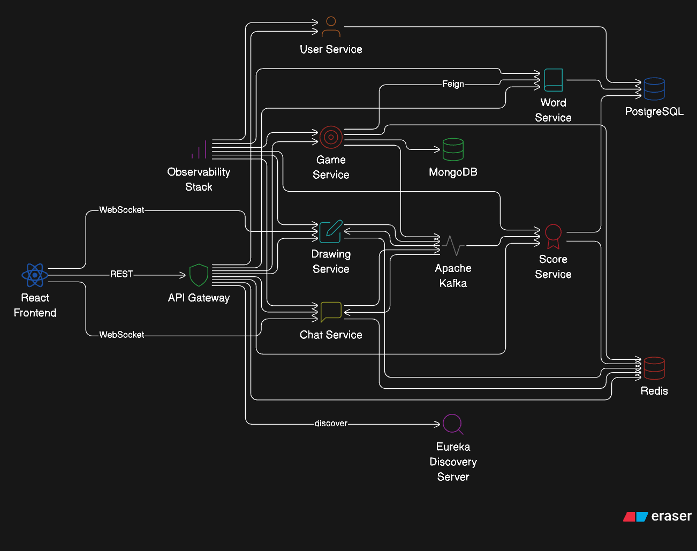
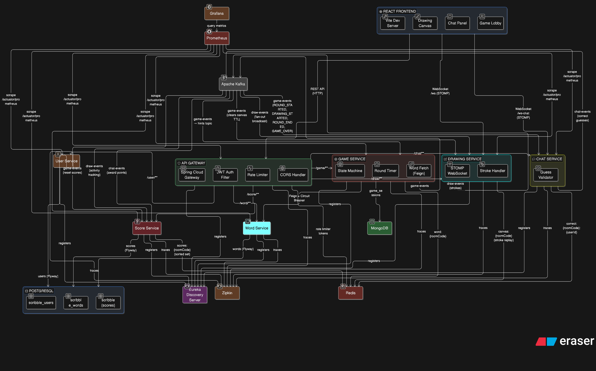
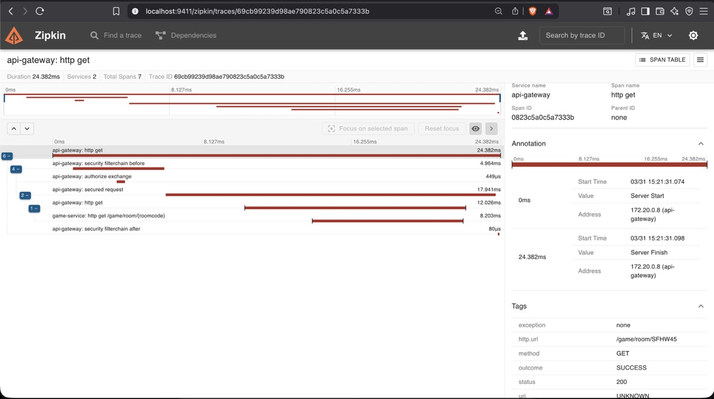
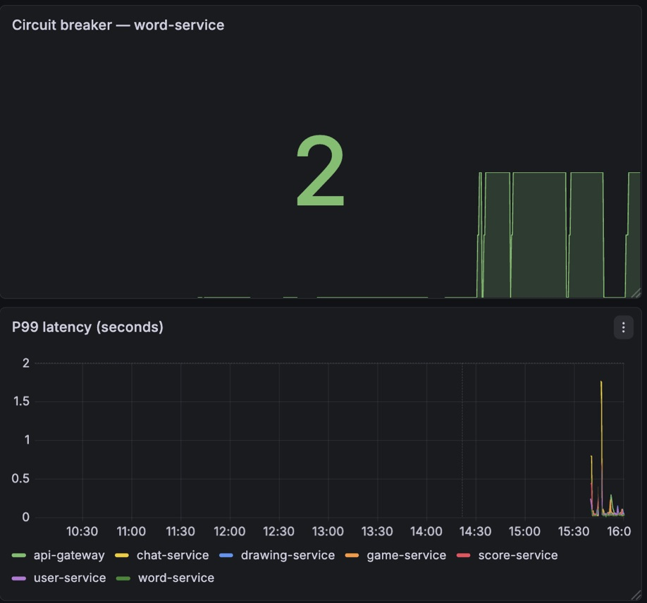
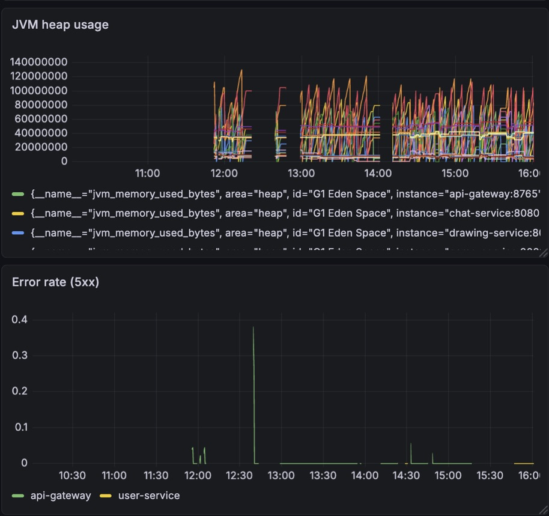
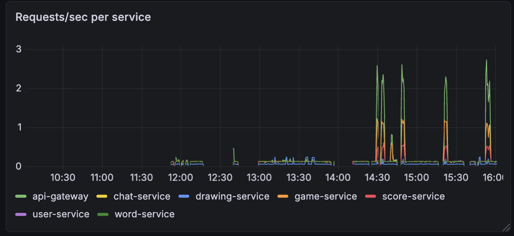

<div align="center">

# 🎨 Doodle-Sync

**A real-time multiplayer drawing & guessing game built with microservices**

Java 21 · Spring Boot 3.5 · React 19 · Kafka · Redis · WebSocket

[Architecture](#architecture) · [How It Works](#how-it-works) · [Quick Start](#quick-start) · [Observability](#observability) · [Load Testing](#load-testing)

</div>

---

## Architecture



<details>
<summary><strong>View detailed architecture →</strong></summary>
<br/>

</details>

### Services at a Glance

| Service | Port | Responsibility | Data Store |
|---------|------|---------------|------------|
| **API Gateway** | 8765 | JWT auth, rate limiting (100 req/min), CORS, routing | Redis (tokens) |
| **User Service** | 8084 | Registration, login, JWT signing | PostgreSQL |
| **Game Service** | 8082 | State machine (WAITING → CHOOSING → DRAWING → RESULTS → GAME_OVER), round timer | MongoDB, Redis |
| **Drawing Service** | 8081 | Stroke ingestion via WebSocket, canvas replay | Redis, Kafka |
| **Chat Service** | 8080 | Guess validation (Levenshtein distance), "close guess" detection | Redis, Kafka |
| **Word Service** | 8085 | Word bank, progressive hints every 15s | PostgreSQL, Kafka |
| **Score Service** | 8083 | Time-decay scoring (100 pts − 1/sec), Redis sorted set leaderboard | PostgreSQL, Redis |
| **Discovery Server** | 8761 | Eureka service registry | — |

---

## Tech Stack

**Backend** — Java 21, Spring Boot 3.5, Spring Cloud Gateway, Eureka, OpenFeign, Resilience4j, Kafka (KRaft), Redis 7, MongoDB 7, PostgreSQL 16

**Frontend** — React 19, Vite 8, @stomp/stompjs, React Router 7, Tailwind CSS 4

**Infrastructure** — Docker, Docker Compose, Prometheus, Grafana, Zipkin, k6

---

## How It Works

### Drawing Pipeline — Drawer to Guessers in <1ms

```
Drawer's browser
  │ WebSocket (STOMP)
  ▼
Drawing Service ─── /app/room.{code}.stroke
  │
  ├─→ Redis (RPUSH canvas:{code})        ← stroke persisted for late-join replay
  │
  └─→ Kafka topic: draw-events           ← fan-out to all instances
        │
        ▼
  Drawing Service (consumer)
        │
        └─→ /topic/room.{code}.canvas    ← broadcast to all subscribed guessers
```

### Guess Validation Flow

```
Guesser types a word
  │ WebSocket (STOMP)
  ▼
Chat Service ─── /app/room.{code}.guess
  │
  ├─ Reads answer from Redis (word:{code})
  ├─ Checks if player already guessed (correct:{code}:{userId})
  │
  ├─ CORRECT  → broadcast "🎉 Player guessed it!" + publish to Kafka (chat-events)
  ├─ CLOSE    → broadcast "so close!" (Levenshtein distance ≤ 1)
  └─ WRONG    → broadcast as regular chat message
```

Score Service consumes `chat-events` → awards **100 − (seconds elapsed × 1)** points (minimum 10) → stores in a Redis sorted set for instant leaderboard queries.

### Progressive Hints

Word Service runs a `ScheduledExecutorService` that reveals one letter every 15 seconds via `game-events` Kafka topic. Characters are revealed in random order:

```
 _ _ _ _ _ _ _     (0s)
 _ _ _ P _ _ _     (15s)
 _ _ _ P _ A _     (30s)
 _ L _ P _ A _     (45s)
```

### Resilience — Circuit Breaker on Word Fetch

Game Service fetches words via **OpenFeign → Word Service** wrapped with Resilience4j:

```
@CircuitBreaker → @TimeLimiter (2s) → @Retry (3 attempts)
```

If Word Service goes down, the circuit opens after 5 failures and a **fallback word pool** kicks in — the game continues uninterrupted. When Word Service recovers, the circuit moves to half-open, tests 3 calls, and closes.

### Kafka Topics

| Topic | Producer → Consumer(s) | Purpose |
|-------|------------------------|---------|
| `game-events` | Game Service → Chat, Drawing, Score, Word | State transitions: ROUND_STARTED, DRAWING_STARTED, ROUND_ENDED, GAME_OVER, HINT |
| `draw-events` | Drawing Service → Drawing Service (fan-out) | Stroke broadcast to all connected clients |
| `chat-events` | Chat Service → Score Service | Correct guess events with elapsed time for scoring |

---

## Quick Start

### Prerequisites
- Docker & Docker Compose
- Node.js 18+ (for frontend dev server)

### Run with Docker Compose

```bash
git clone https://github.com/santrupt29/Doodle-Sync.git
cd Doodle-Sync
docker compose up --build
```

> First build takes 5-8 minutes (Maven downloads + Docker image builds).
> Services start in dependency order via healthcheck chains.

**After all services are healthy:**

```bash
cd client
npm install
npm run dev
```

| Service | URL |
|---------|-----|
| Frontend | http://localhost:5173 |
| API Gateway | http://localhost:8765 |
| Eureka Dashboard | http://localhost:8761 |
| Grafana | http://localhost:3001 (admin / scribble) |
| Zipkin | http://localhost:9411 |
| Prometheus | http://localhost:9090 |

### Environment Variables

Create a `.env` file in the project root (a default is included):

```env
DB_PASSWORD=password
JWT_SECRET=dev-secret-key-change-in-production-256bit
```

---

## Observability

All 7 services export traces to **Zipkin** and metrics to **Prometheus** (scraped every 15s from `/actuator/prometheus`). Grafana ships with a pre-provisioned dashboard.

### Distributed Tracing — Zipkin

A single user action (e.g., creating a room) generates a trace that spans across API Gateway → Game Service → Word Service, showing the full request lifecycle:



### Grafana Dashboard

The provisioned dashboard includes:
- **Request rate** per service (req/s)
- **P99 latency** (histogram quantile)
- **5xx error rate** per service
- **JVM heap usage** per service
- **Circuit breaker state** for word-service





---

## Load Testing

WebSocket stroke throughput tested with [k6](https://k6.io/):

**Scenario:** 8 concurrent WebSocket connections, 10 strokes/sec per VU, 60 seconds sustained

```
  █ THRESHOLDS

    stroke_latency_ms
    ✓ 'p(99) < 200'         p(99) = 1ms

    ws_connect_errors
    ✓ 'count < 3'           count = 0

  █ TOTAL RESULTS

    strokes_sent............: 7,190    ~80/s
    stroke_latency_ms.......: avg=0.2ms   p(90)=1ms    p(99)=1ms
    ws_connecting...........: avg=25ms    p(90)=33ms
    ws_msgs_received........: 57,424   ~630/s
    ws_sessions.............: 16        (8 VUs × 2 connections)
    iterations..............: 8         complete, 0 interrupted
    checks_succeeded........: 100%      ✓ WS connected
```

Run it yourself:

```bash
k6 run load-tests/stroke-load-test.js 2>&1 | tee docs/k6-results.txt
```

---

## Project Structure

```
Doodle-Sync/
├── api-gateway/             Spring Cloud Gateway + JWT filter + rate limiter
├── discovery-server/        Eureka service registry
├── user-service/            Auth (register/login) + JWT + PostgreSQL
├── game-service/            Game state machine + round timer + MongoDB
├── drawing-service/         WebSocket strokes + Redis replay + Kafka fan-out
├── chat-service/            WebSocket guesses + Levenshtein validator
├── word-service/            Word bank + progressive hints
├── score-service/           Time-decay scoring + Redis leaderboard
├── client/                  React 19 + Vite + STOMP WebSocket
├── monitoring/
│   ├── prometheus.yml
│   └── grafana/provisioning/
│       ├── datasources/     Prometheus datasource (auto-provisioned)
│       └── dashboards/      Dashboard JSON + provisioner
├── load-tests/              k6 WebSocket stroke load test
├── postgres-init/           init.sql (3 databases, roles, grants)
├── docs/                    Architecture diagrams, screenshots, results
└── docker-compose.yml       15 containers, healthcheck chains
```

---

## Key Design Decisions

| Decision | Why |
|----------|-----|
| **Direct WebSocket** (bypass gateway) | Browsers can't attach JWT headers during WebSocket upgrade; drawing/chat services handle auth independently |
| **Kafka fan-out** for strokes | One stroke from the drawer reaches N guessers without N direct connections or O(N²) relay |
| **Redis for ephemeral state** | Canvas strokes, current word, guess dedup, leaderboard — all expire with TTL, no schema needed |
| **MongoDB for game sessions** | Flexible schema for dynamic player lists, nested state, and room config |
| **PostgreSQL for structured data** | Users, words, scores — relational integrity with Flyway migrations |
| **Levenshtein distance for "close" guesses** | Single-letter typos ("elefant" → "elephant") shouldn't be punished in a fast-paced game |
| **Time-decay scoring** | Faster guesses earn more points (100 − seconds elapsed), with a floor of 10 |
| **Fallback word pool** | If word-service is down, the game picks from a hardcoded pool — never blocks |

